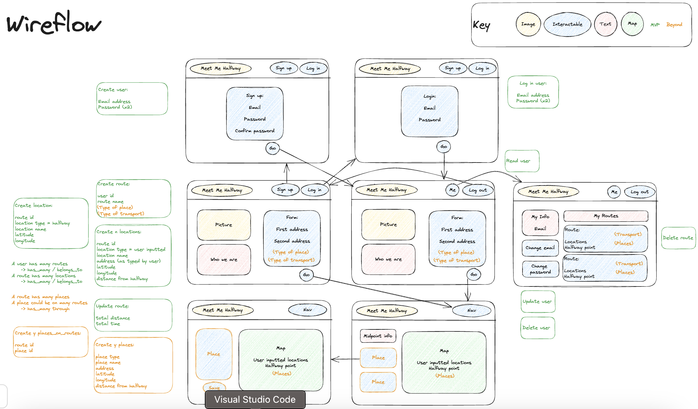
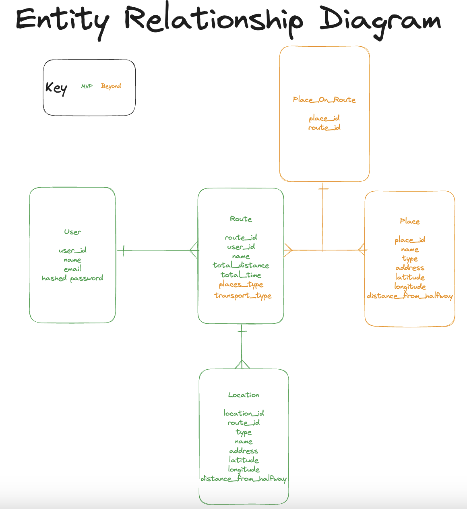

# Meet Me Halfway

This repo contains the source code for my fourth and final project of General Assembly's Software Engineering Immersive course (13th March - 9th June 2023). 

The project is my first attempt to showcase the skills I have been picking up in Ruby on Rails, which was totally new to me before the course.

Project 4 runs from 30th May - 8th June (7 working days) and is an independent project.

___

## Deployment

(TBD - currently points to SunChaser)
[Meet someone halfway now via my custom domain](http://louisejones94.co.uk)

___
## Technologies Used

- Ruby
    - Front end interactivity
- Rails
    - Back end 
- CSS
    - Flexbox
- VS Code
    - Text editing
    - Accessing Git via CLI
- Chrome developer tools
    - Inspecting elements, layout etc
    - Debugging
- Postman
    - API testing

___
## Brief

### Big Goals

1. A full stack web application, with:
    1. At least 2 models with full CRUD on at least one model and Add/Delete on any remaining models, and
    1. User authentication

### Technical Requirements

- Have at least 2 models
- Use authentication
- Have full CRUD on at least one model
- Be able to Add/Delete on any remaining models
- Have high quality code:
    - Follow accepted naming conventions
    - Consistent indentation
    - Well-structured and readable code
    - Semantic naming of variables, functions, CSS classes, etc.
    - Short and clear functions that do one thing
    - Efficient code - MVP first, then refactor
    - DRY (Don't Repeat Yourself) code
- Be deployed on Heroku or similar platform
- A README.md file that explains the app

### Full Brief

Found at https://git.generalassemb.ly/SEI-LND-71/Project-4

___
## Planning

### User Stories

### Minimum Viable Product (MVP)

- As a user, I want to input two locations for myself and another person, so we can find a halfway point that minimises our travel distances.
- As a user, I want to see the halfway point on a map, so I can visualise potential meeting locations.
- As a user, I want to save routes so I can revisit them later.
- As a user, I want to keep my information private, so I don't get hacked.

### Beyond MVP

- As a user, I want to use log in information that I already use elsewhere, so I don't have to remember more passwords.
- As a user, I want to see driving directions from both locations to the meeting point, so I know how to get there.
- As a user, I want to select different modes of transport (e.g. walking, cycling, public transport) to calculate the meeting point, so I can find the best way to travel.
- As a user, I want to input more than two locations, so I can find a halfway point for meetings with multiple people.
- As a user, I want to search for different types of places (e.g., restaurants, parks, coffee shops) near the halfway point on the map, so I can identify venues for our gathering.
- As a user, I want to filter the displayed places on the map based on specific criteria (e.g. cuisine type, rating), so I can find a venue that matches our preferences.
- As a user, I want to see information about the displayed places (e.g. contact details, reviews), so I can make a decision about where to meet.
- As a user, I want to save and share the meeting location, including the displayed places on the map, with other people, so we can all have access to the details.
- As a user, I want to see alternative routes and estimated travel times for each mode of transport, so I can choose the best option for my journey.
- As a user, I want to see traffic information, so I can choose the best meeting time.

### Wireframe

I used Excalidraw to create a wireflow: 
A more detailed view can be found at: https://excalidraw.com/#json=xV65UtrBFz-0S5l1y3rgS,FmesD8ys3zkcZ3au7_Rhmg

### Entity Relationship Diagram

I used the same Excalidraw to draw an entity relationship diagram: 
A more detailed view can be found at: https://excalidraw.com/#json=xV65UtrBFz-0S5l1y3rgS,FmesD8ys3zkcZ3au7_Rhmg

### Project Management
I used [this Jira board](https://louisejones.atlassian.net/jira/software/c/projects/MMHW/boards/1) to add in target start and end dates and time tracking estimates so I could check how realistic my original plans were.

___
## Build/Code Process

### Day 1

- Wireframe
- User Stories
- Planning
- ERD diagram
- Git set up
- Project skeleton set up

___
## Challenges

___
## Wins

___
## Other Learnings/Takeaways

___
## Bugs

___
## Future Improvements

## 
* Ruby version

* System dependencies

* Configuration

* Database creation

* Database initialization

* How to run the test suite

* Services (job queues, cache servers, search engines, etc.)

* Deployment instructions

